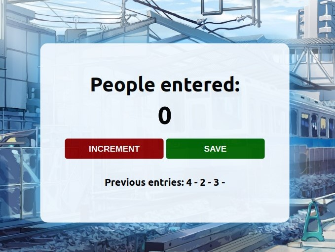

# Passenger Counter App
 Your very first JavaScript app will be a passenger counter. This gives you an intro to the basic principles of web development.

## Table of contents
- [Introduction](#introduction)
- [Overview](#overview)
  - [Screenshot](#screenshot)
  - [Built using](#built-using)
  - [Lessons Learned](#lessons-learned)
- [Author](#author)
- [Acknowledgement](#acknowledgement)
## Introduction
- This is my solution to the first part of [Learn JavaScript](https://scrimba.com/learn/learnjavascript).
- This webpage is a simple app for counting passengers, with some functionalities such as:
    - Increment Button
    - Save Button
    - Previous entries section

## Overview
- Link: [github.com/kierhb/passengercounter](https://github.com/kierhb/passengercounter)

### Screenshot

### Built using

- HTML5 markup
- CSS
- Vanilla JavaScript

### Lessons Learned

- Setting up the JavaScript file.
- Getting familiar with DOM's and assigning them to variables for easier access.
- Assigning functions when clicking for the Increment and Save Button:
    - Such as using functions to write lesser codes.
- Writing functions to log the sum.

## Author

- GitHub - [@kierhb](https://github.com/kierhb)
- LinkedIn - [Kier Bobila](https://www.linkedin.com/in/kier-bobila/)

## Acknowledgement
I want to acknowledge one of the co-founders and CEO of [Scrimba](https://scrimba.com), the course instructor Per Harald Borgen and to all members of Scrimba community.